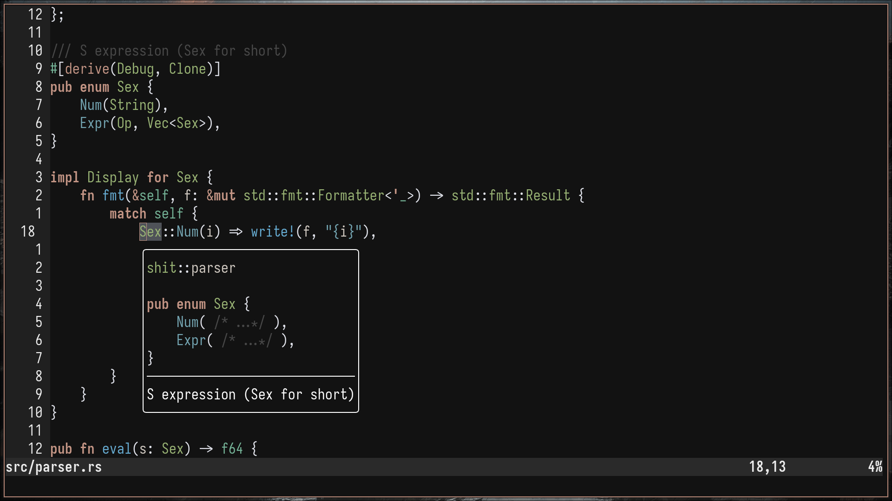

# Hell bigma
This theme is based on this:

image

# installation
with your package manager just add
```
'Taice/boat.vim'
```
to your neovim you can figure it out
and then

```
colorscheme boat
```

to turn it on :nyaah:
